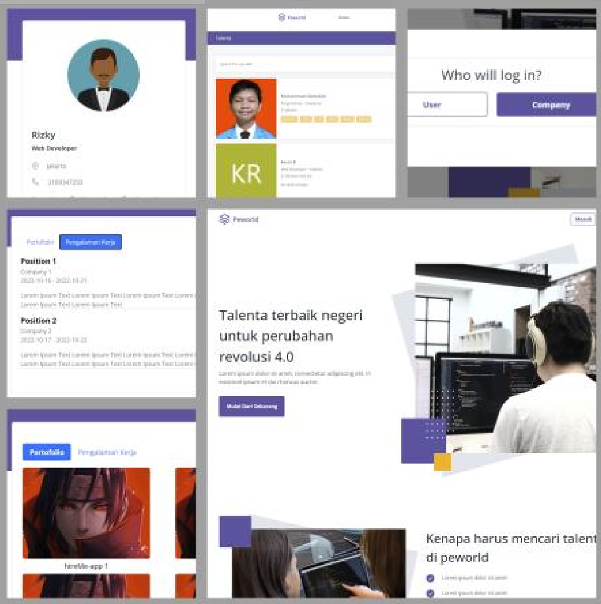

<h1 align='center'>Hire-Me</h1>
  

    <a href="link_deploy">View Demo</a>
    ·
    <a href="https://github.com/usergithub/hire-me-backend/issues">Report Bug Backend</a>
    ·
    <a href="https://github.com/hireMe123123/hire-me-frontend/issues">Report Bug Frontend</a>
    ·
    <a href="https://github.com/usergithub/hire-me-backend/pulls">Request Feature Backend</a>
    ·
    <a href="https://github.com/hireMe123123/hire-me-frontend/pulls">Request Feature Frontend</a>
  

## About The Project

The app where you can connect to hundreds of top company. Easy way to find best employee to work on your company.

## Built With

## Requirements

1. <a href="https://nodejs.org/en/download/">Node Js</a>
2. Node_modules `npm install` or `yarn install`
3. Backend API #Hire-me [`here`](https://github.com/hireMe123123/hire-me-backend)
4. Frontend #Hire-me [`here`](https://github.com/hireMe123123/hire-me-frontend)

## Getting Started

1. Download this Project or you can type `git clone https://github.com/hireMe123123/hire-me-backend.git`
2. Open app's directory in CMD or Terminal
3. Type `npm install` or `yarn install`
4. Add .env file at root folder project

REACT_APP_ENDPOINT = [Backend API]

5. Type `npm run dev`

## Acknowledgements

- [Axios](https://www.npmjs.com/package/axios)
- [Cloudinary](https://cloudinary.com/)
- [Express](https://www.express.com)
- [React](https://reactjs.org/)
- [React Bootstrap](https://react-bootstrap.github.io/)
- [Redis](https://redis.com/)
- [Redux](https://redux.js.org/)
- [Supabase](https://supabase.com/)

## Team - untuk project team

© [Hire-Me](https://github.com/hireMe123123)

> All Members of Default Team

|          <a href="https://github.com/azkar-sh" target="_blank">**Full-Stack Developer & Team Leader**</a>          |                 <a href="https://github.com/KevinReyhanW" target="_blank">**Front-End Developer**</a>                  |                 <a href="https://github.com/mabdullah12101" target="_blank">**Front-End Developer**</a>                  |                 <a href="https://github.com/rizkyark" target="_blank">**Front-End Developer**</a>                  |                 <a href="https://github.com/saintrosid21" target="_blank">**Back-End Developer**</a>                  |                      <a href="https://github.com/Fhmi00" target="_blank">**Back-End Developer**</a>                       |               <a href="https://github.com/ahmaddhohirazhari" target="_blank">**Back-End Developer**</a>               |
| :----------------------------------------------------------------------------------------------------------------: | :--------------------------------------------------------------------------------------------------------------------: | :----------------------------------------------------------------------------------------------------------------------: | :----------------------------------------------------------------------------------------------------------------: | :-------------------------------------------------------------------------------------------------------------------: | :-----------------------------------------------------------------------------------------------------------------------: | :-------------------------------------------------------------------------------------------------------------------: |
|  |  |  |  |  |  |  |
|              <a href="https://github.com/azkar-sh" target="_blank">`https://github.com/azkar-sh`</a>               |            <a href="https://github.com/KevinReyhanW" target="_blank">`https://github.com/KevinReyhanW`</a>             |           <a href="https://github.com/mabdullah12101" target="_blank">`https://github.com/mabdullah12101`</a>            |              <a href="https://github.com/rizkyark" target="_blank">`https://github.com/rizkyark`</a>               |            <a href="https://github.com/saintrosid21" target="_blank">`https://github.com/saintrosid21`</a>            |         <a href="https://github.com/ahmaddhohirazhari" target="_blank">`https://github.com/ahmaddhohirazhari`</a>         |                  <a href="https://github.com/Fhmi00" target="_blank">`https://github.com/Fhmi00`</a>                  |

---
